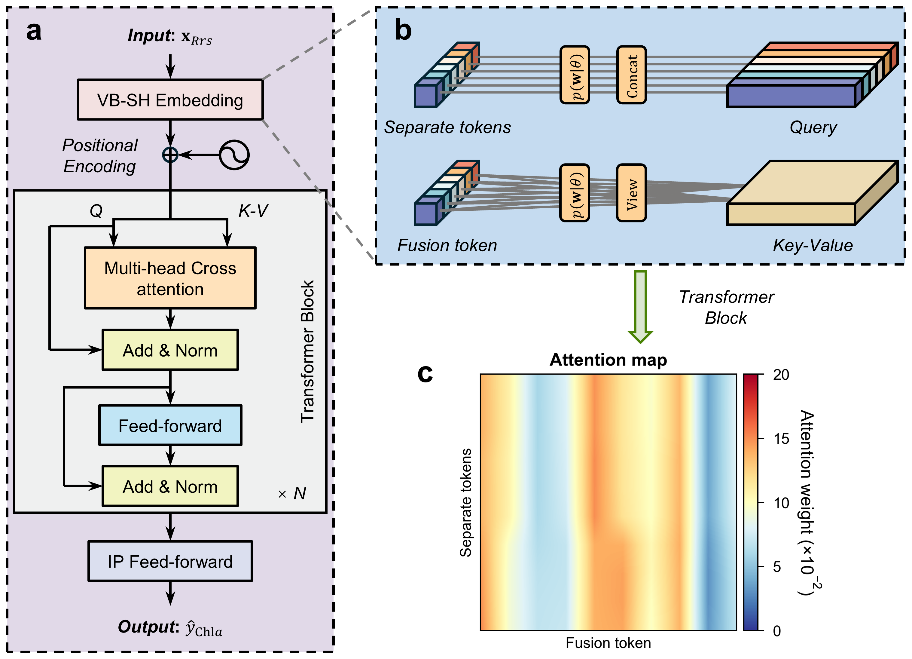

## <p align=center> VB-OCformer: a hierarchically data-driven approach for global chlorophyll-*a* mapping with uncertainty quantifications</p>

<p align='center' width='100%'>
    
</p>

This repository is the official PyTorch implementation of the VB-OCformer model, which leverages deep learning algorithms to self-adaptively tackle intricate optical variations in diverse waters, informed by modeled prior knowledge instead of simplistic theories, and deliver global nondeviant Chla estimations with uncertainty quantifications.


This repository contains:
* 🚀 Complete PyTorch [implementation](src/model/model.py) of VB-OCformer.
* 🪐 [Optimizing script](optimize.py) using the [Hyperopt toolkit](https://hyperopt.github.io/hyperopt).
* ⚡️ [Training script](train.py) with a variational learning method.
* 🛸 [Inference script](inference.py) utilizing the models supplied in 'onnx' format.

Supplementary data and trained models are available at https://doi.org/10.5281/zenodo.15716616.

## Setup
Download and set up the repository:
```bash
git clone https://github.com/liangOnlytao/VB-OCformer.git
cd VB-OCformer
```

This project has been successfully executed in a conda environment with Python 3.10, PyTorch 2.4.1, CUDA 11.8, and cuDNN 8.9. To execute this project, you can attempt to establish the relevant conda environment with the following command:
```bash
conda create -n VB_OCformer-env python=3.10
conda activate VB_OCformer-env
conda install pytorch==2.4.1 torchvision==0.19.1 torchaudio==2.4.1  pytorch-cuda=11.8 -c pytorch -c nvidia
conda install conda-forge::hyperopt scikit-learn  
```

## Optimizing
After downloading our constructed match-up datasets, you may utilize the following command to acquire the optimal hyperparameter configurations for model training. *This example shows how we use the Hyperopt toolkit for optimizing model hyperparameters on the 'MODIS-Aqua' dataset, with 100 optimization iterations.*
```bash
python optimize.py --satellite 'MODIS-Aqua' --cuda_index 0 --max_evals 100
```

## Training
Utilizing the optimal  hyperparameter configurations obtained  above, you may train the model with the subsequent command:
```bash
python train.py --satellite 'MODIS-Aqua' --cuda_index 0
```

## Inference
You can use the subsequent command to estimate global chlorophyll-*a* with the relevant ocean color sensor data, available for download from the [Ocean Biology Distributed Active Archive Center (OB.DAAC) at NASA Goddard Space Flight Center (GSFC)](https://oceancolor.gsfc.nasa.gov/).
```bash
python inference.py --satellite 'MODIS-Aqua' --device_id 0
```
